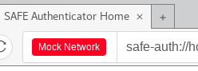
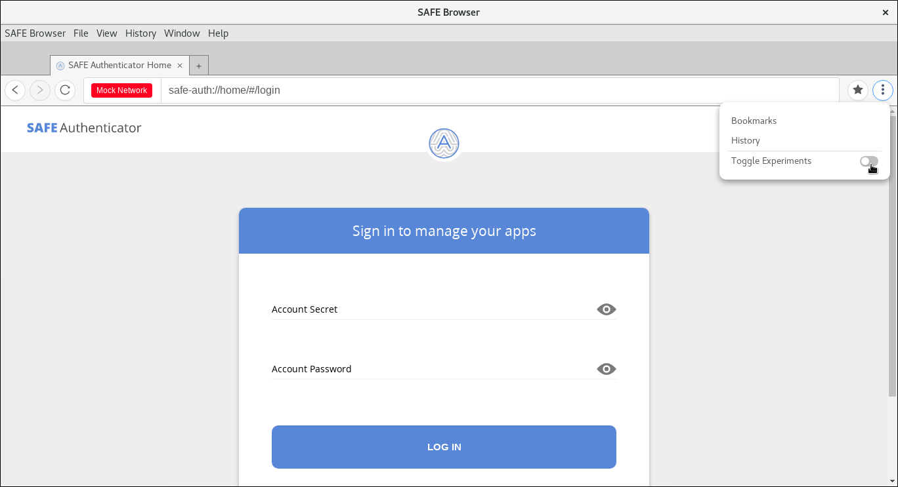
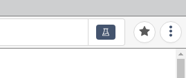
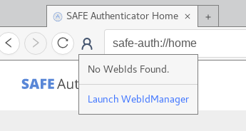
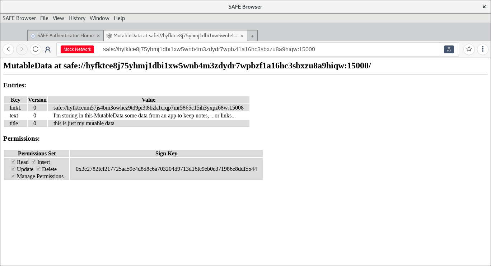

# SAFE Browser

## About

Built upon [peruse](https://github.com/joshuef/peruse), but using its baked in extensibility to add [SAFE Network](https://safenetwork.tech) functionality.

## Installation

For normal SAFE Network browsing, you should download the latest version of the browser from [The SAFE Browser releases](https://github.com/maidsafe/safe_browser/releases/latest) page.

Application developers should use the same link, but choose the `-dev` postfixed version for their platform. This version uses a `mock` network to allow local development (without the need to pay PUT costs on a live SAFE Network).

## WebApp Development

There are `-dev` postfixed releases of SAFE Browser available. These come with both live network and mock network libs, bundled.

By default, opening the app will open SAFE Browser for the mock network.

Otherwise, there is the option to pass a `--live` flag to the browser. This will start the browser in a `live` network mode.

eg, on OSX:

```bash
open SAFE Browser.app --args --live
```

When the SAFE Browser launched is the one for the mock network, a visual indicator is displayed in the address bar, on the left hand side of the URL address bar as shown in the following image:



Therefore, if you are not seeing this red `Mock Network` label in the browser, it means you are then connected to the live Alpha2 network. This is very important to note since in the case of using the Mock network the data won't be stored in the secure, autonomous and decentralised SAFE Network, but just in a local temporary file.

### SAFE Network API

SAFE Browser exposes a set of APIs in the DOM which webapps can make use to connect to the SAFE Network, as well as fetch and store data on it.

A webapp has direct access to this set of APIs through the DOM at `window.safe`.

The SAFE Network client API exposed by SAFE Browser is a simple wrapper on top of the API provided by the `@maidsafe/safe-node-app` package (with a few minor exceptions explained below), therefore the documentation available for the `safe-node-app` API is valid and is the main reference for any developer wanting to create a webapp for The SAFE Network.

This API documentation can be found at the following URL: https://docs.maidsafe.net/safe_app_nodejs

As an example, if a webapp is trying to make use of the [initialiseApp](https://docs.maidsafe.net/safe_app_nodejs/global.html#initialiseApp) function, it simply needs to prefix the function name with `window.safe`, i.e. it shall simply call `window.safe.initialiseApp` and provide the parameters as described in that documentation. Note that it's not needed to import/require the `safe-app-node` package with `require('@maidsafe/safe-node-app')` from a webapp.

You will find some example code snippets in the [API documentation](https://docs.maidsafe.net/safe_app_nodejs) as well, that you can use to learn, and also look at the [Debugging section](#debugging) below for the interactive tool to try out the API.

As mentioned above, there are only a few functions related to the initialisation and app authorisation request process that are exposed by SAFE Browser and which slightly differ from the `safe-app-node` API:

- There are no [initialisation options](https://docs.maidsafe.net/safe_app_nodejs/global.html#InitOptions) supported by the [initialiseApp](https://docs.maidsafe.net/safe_app_nodejs/global.html#initialiseApp) function exposed in the DOM API
- There are no [initialisation options](https://docs.maidsafe.net/safe_app_nodejs/global.html#InitOptions) supported by the [fromAuthUri](https://docs.maidsafe.net/safe_app_nodejs/global.html#fromAuthUri) function exposed in the DOM API
- [openUri](https://docs.maidsafe.net/safe_app_nodejs/AuthInterface.html#openUri) is not available in the DOM API. A webapp shall instead call the `window.safe.authorise` function to send an authorisation request to the Authenticator. E.g.:

  ```js
  const appInfo = {
    name: 'Hello SAFE World',
    id: 'net.maidsafe.tutorials.web-app',
    version: '1.0.0',
    vendor: 'MaidSafe.net Ltd.'
  };

  async function authoriseAndConnect() {
    console.info('Initialising a SAFE app client instance...');
    const safeApp = await window.safe.initialiseApp(appInfo);

    console.info('Authorising the application...');
    const authReqUri = await safeApp.auth.genAuthUri();
    const authUri = await window.safe.authorise(authReqUri);
    console.info('SAFE application authorised by user');

    await safeApp.auth.loginFromUri(authUri);
    console.info('Application connected to the network');
  }
  ```

### Experimental APIs and features

You are free to use any of the exposed experimental APIs and features, to explore the features and APIs that are being actively developed.

Although you should be aware of the fact that all/any of the experimental APIs/features may be changed, deprecated, or even removed in the future, and without much anticipated notification by the core developers.

The reason they are exposed is to allow developers to experiment and start learning about the APIs at an early stage. In many circumstances there are features and/or APIs being developed which are not fully finalised, or perhaps, the functionality can still change in the future as things evolve along the way. In this case it's very beneficial to get community feedback early in the process, allowing them to use, test, play with them, and provide feedback about these new features. As such, the SAFE Browser exposes a toggle to enable/disable this type of experimental features or APIs, while at the same time clearly labelling the fact that they are still in an experimental stage. Every time this toggle is switched on/off, all tabs are refreshed automatically. These experimental features and APIs are by default not enabled when the browser is launched, this is to make sure the user is aware of the fact that the browser and webapps/websites could be using experimental features and/or APIs, since they have to be explicitly enabled by the user. You can find the toggle on a new menu located on the right hand side of the address bar, as show in the following image:



When the experimental APIs/features are enabled with this toggle, a visual indicator is displayed on the right hand side of the URL address bar. If you don't see this indicator it means the experimental APIs are not enabled or available to neither the browser nor to any website/webapp.



#### SAFE WebID

SAFE uses the RDF compliant WebID system for easily enabling user identities.

The WebID switcher/selector exposed in the browser makes use of some experimental APIs, and it's in itself still in an experimental stage, therefore this feature is only exposed in the browser when the experimental APIs are enabled using the toggle from the options menu as detailed above. This is the only feature currently being exposed as experimental in the browser.



Any webapp can retrieve the currently selected WebID via `window.currentWebId` function.

Additionally, it can listen for changes via the event emitter, `window.webIdEventEmitter`, eg:

```js
webIdEventEmitter.on('update', webId => {
  console.info('An update to current WebID occurred!', webId);
});
```

There is a set of available experimental APIs which are utilities to manipulate WebIDs and public names, please refer to the [API documentation](https://docs.maidsafe.net/safe_app_nodejs) for details.

#### RDF utilities

Another set of utilities in their early stage of development can be found in the RDF and WebID emulations. As you probably know our `MutableData` API supports emulations to be implemented on top of them, e.g. our NFS emulation allows apps to access the MutableData data as if it was a files directory.

In an analogous way to the NFS emulation, the RDF and WebID emulations can be applied on top of any `MutableData` object, e.g.:

```js
const safeApp = await window.safe.initialiseApp( appInfo );
// authorise and connect to the network...
...
const md = await safeapp.mutableData.newRandomPublic( 15001 );
await md.quickSetup();
const rdfEmulation = await md.emulateAs( 'RDF' );
```

Again, please refer to the [API documentation](https://docs.maidsafe.net/safe_app_nodejs) for details of these utilities.

#### Support for XOR-URLs:

Not only does the DOM API allow SAFE applications to link/reference any MutableData/ImmutableData on the network using its XOR-URL (URL based on its XoR name location on the network), but it also enables the SAFE Browser to fetch any website, webapp, or random file from the network using a XOR-URL. Note this is in addition to being able to fetch content using the SAFE DNS (Decentralised Naming System) with publicName-URLs, e.g. `safe://subname.pubname`.

Even HTML tags can reference content from a src attribute using XOR-URLs, e.g. an image tag can have a XOR-URL in the src attribute, and the browser is capable of fetching it and render it as usual.

As shown in the screenshot below, the SAFE Browser is capable of decoding the XOR-URL to extract the location of the content, content type (if the mimeType is also encoded in the XOR-URL), fetch it, and render it accordingly as it does it with any publicName-URL (i.e. the URLs which make use of the SAFE DNS system):


A good resource to learn and understand a bit more about XOR-URLs (as a user) is by visiting this little tutorial where it explains different cases for how to share websites and files with publicName-URLs and XOR-URLs, just access the following safe-URL and follow the links: [safe://xorurl.tutorials](safe://xorurl.tutorials)

Please note that since the XOR-URLs are still in its experimental stage you'll need to switch the toggle form the browser to be able to use them to fetch content.

For more details/information about the XOR-URLs, you can read the proposed [RFC](https://github.com/maidsafe/rfcs/blob/357384147ae005e4061079b27a30f43cf379fda5/text/0000-xor-urls/0000-xor-urls.md), or the [discussions taking place in our DevForum](https://forum.safedev.org/t/xor-address-urls-xor-urls/1952), or by watching this [screencast](https://www.youtube.com/watch?v=BikfxRNARnM).

#### Example applications using experimental APIs

If you want to learn more about how applications can make use of these experimental APIs and features exposed by the SAFE Browser, you can refer to:

- [Patter (safe://patter.dapp)](safe://patter.dapp), which is a proof-of-concept decentralised Twitter clone ([source code](https://github.com/maidsafe/safe-patter-js))
- The [WebID Mgr. proof-of-concept webapp (safe://webidmgr.dapp)](safe://webidmgr.dapp)([source code](https://github.com/maidsafe/safe-web-id-manager-js))

#### The MutableData viewer

When a URL (either publicName-URL or XOR-URL) is targeting a `MutableData`, which happens to not have an "index.html" file, or which is probably not even a files container (a.k.a. an NFS container) but simply a `MutableData` created by any application to store data on the network, a `MutableData` viewer is rendered by the SAFE Browser. This web-based viewer displays the list of `MutableData` entries, showing the key, version and value of each of them, and it also displays the permissions sets defined for such a `MutableData`. This is a very basic first version, which can hopefully evolve into a SAFE data browser in the future.



### Debugging

A `--debug` flag is also available to get extra logs and devtool windows when working with a packaged application.

Additionally, the `--preload` flag can be passed in order to get the following features preloaded in `mock` network mode:

- An [interactive tool](https://github.com/maidsafe/safe_examples/tree/master/safe_web_api_playground) to learn about the browser's SAFE network API, located at `safe://api.playground`
- Account login credentials, both secret and password being `mocksafenetworkdeveloper`

`open SAFE Browser.app --args --mock --preload`

## Browser Development

### Compiling

#### Prerequisites

- [Node.js](https://nodejs.org) ^8.0.0 (we recommend installing it via [nvm](https://github.com/creationix/nvm))
- [Git](https://git-scm.com/)
- [Yarn](https://yarnpkg.com) (as a replacement for `npm`).
- Windows-specific:
  - Yarn attempts to build modules concurrently with multiple child processes, which causes intermittent timing issues on Windows. Users need to run `yarn config set child-concurrency 1` just once to effect local yarn settings.
  - In order to be able to build native Node modules for this library, run `npm install --global --production windows-build-tools` which installs Python 2.x, Visual Studio 2015 build tools, and Visual C++ build tools.
- If you are using Ubuntu, Mint, or Debian 9 as OS, `libgconf-2-4` and/or `build-essential` dependencies might be missing. Please install them as needed with Synaptic Package Mgr., or with `apt` from a shell console: `$ sudo apt-get install libgconf-2-4 build-essential`

#### Building the Browser

- `git clone https://github.com/maidsafe/safe_browser.git`
- `cd safe_browser`
- `NODE_ENV=dev yarn` (`NODE_ENV` is needed to install mock libs and to run `yarn mock-dev`).
- `yarn rebuild`

And to run dev mode:

- `yarn mock-dev`

Want to run 'production' variables, but with hot reloading?

- `yarn put-live-net-files-for-<windows|osx|linux>`
- `yarn prod-dev`

Note, you'll need a crust.config set for the application. [Helper commands for osx/linux/windows](https://github.com/maidsafe/safe_browser/blob/master/package.json#L55-L58)

And to package:

- `yarn package`

The resulting packages are contained within the `releases` folder.

A packaged application, built in a `NODE_ENV=dev`, can access either `prod` or `dev` networks. `prod` is the default, or alternatively you can open the application and pass a `--mock` flag to open and use a mock network.

#### Build commands

There are a few build commands for various situations:

- `yarn mock-dev` will run a developer version of the application using `MockVault`
- `yarn prod-dev` will run a developer version of the application using the live network.
- `yarn build` compiles all code, but you shouldn't need to use this
- `yarn build-preload` will need to be run whenever you change the `preload.js` file for changes to show up in the browser.

### Release

`yarn bump` is available for automatically updating versions and generating a changelog update based upon conventional-commits.

### Redux

The core is built around redux for simple state management allowing for easy
extensibility.

### React

The interface is built in react for simple data flow and clear componentisation.

### Webpack

`webpack.config.base` contains loaders and alias' used across all webpack configs.

There is a prod, config. Alongside renderer configs.

When developing against hot reloading, the `vendor` setup is used to speed up build times etc.

There are 'dev' mode configs for running against the NODE_ENV=develeopment setup.
There are 'live-dev' configs for running against NODE_ENV=production but without needing to package.

### Testing

- `yarn test` runs jest (you have the optional `yarn test-watch`, too).
- `yarn test-e2e` runs spectron integration tests (not yet stable).
- `yarn lint` ...lints...

### Logging

Via electron-log: `import logger from 'logger'`, and you can `logger.info('things')`.

Logs are printed to both render console and stdout. Logs are also written to a log file per system.

`yarn log-osx` will tail the file. Similar commands (as yet untested) exist for linux/windows.

## SAFE Network

The `safe` code is contained within the `app/extensions` folder. This includes
a simple http server with is used to provide the http like functionalities of the safe network.

Currently you need to authenticate against the SAFE Browser to get network access.

### Authenticator

Currently, we're using a `temp_dist` version of the authenticator webapp, prebuilt from the 'beaker-plugin-safe-authenticator'.

- APIs are located in `app/extensions/safe/api`;
- APIs are located in `app/extensions/safe/auth-api`;

## Further Help

You can discuss development-related questions on the [SAFE Dev Forum](https://forum.safedev.org/).
If you are just starting to develop an application for the SAFE Network, it's very advisable to visit the [SAFE Network Dev Hub](https://hub.safedev.org) where you will find a lot of relevant information, including tutorials.

## License

SAFE Browser is a lightly modified fork of the [Peruse Browser](https://github.com/joshuef/peruse).

This SAFE Network application is dual-licensed under the Modified BSD ([LICENSE-BSD](LICENSE-BSD) https://opensource.org/licenses/BSD-3-Clause) or the MIT license ([LICENSE-MIT](LICENSE-MIT) https://opensource.org/licenses/MIT) at your option.
