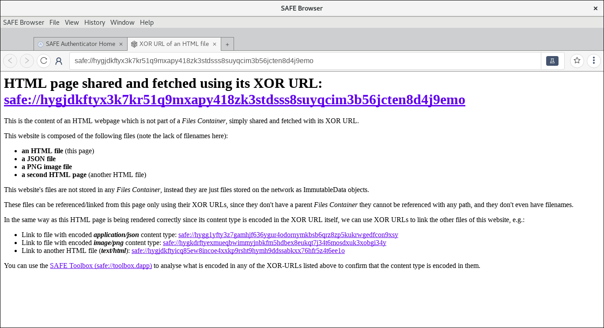

# WebApp Development

## Table of contents

1. [SAFE Network API](#safe-network-api)
1. [XOR-URls](#xor-urls)
1. [Debugging](#debugging)

## SAFE Network API

SAFE Browser exposes a set of APIs in the DOM which webapps can make use to connect to the SAFE Network, as well as fetch and store data on it.

A webapp has direct access to this set of APIs through the DOM at `window.Safe`.

The SAFE Network client API exposed by SAFE Browser is a simple wrapper on top of the API provided by the [`@maidsafe/sn_nodejs`](https://github.com/maidsafe/sn_nodejs) package.

The APIs available are currently very limited, as they are not final. As we get further into safe-api development, more will be exposed and with that we'll be writing more complete documentation.

### XOR-URLs

Not only does the DOM API allow SAFE applications to link/reference any data on the network using its XOR-URL (URL based on its XoR name location on the network), but it also enables the SAFE Browser to fetch any website, webapp, or random file from the network using a XOR-URL. Note this is in addition to being able to fetch content using the SAFE NRS (Name Resolution System)[https://safenetforum.org/t/so-you-want-to-make-a-safe-website/29709] with publicName-URLs, e.g. `safe://subname.pubname`.

Even HTML tags can reference content from a src attribute using XOR-URLs, e.g. an image tag can have a XOR-URL in the src attribute, and the browser is capable of fetching it and render it as usual.

As shown in the screenshot below, the SAFE Browser is capable of decoding the XOR-URL to extract the location of the content, content type (if the mimeType is also encoded in the XOR-URL), fetch it, and render it accordingly as it does it with any publicName-URL (i.e. the URLs which make use of the SAFE NRS system):

A good resource to learn and understand a bit more about XOR-URLs (as a user) is by visiting this little tutorial where it explains different cases for how to share websites and files with publicName-URLs and XOR-URLs, just access the following safe-URL and follow the links: [safe://xorurl.tutorials](safe://xorurl.tutorials)

For more details/information about the XOR-URLs, you can read the proposed [RFC](https://github.com/maidsafe/rfcs/blob/357384147ae005e4061079b27a30f43cf379fda5/text/0000-xor-urls/0000-xor-urls.md), or the [discussions taking place in our DevForum](https://forum.safedev.org/t/xor-address-urls-xor-urls/1952), or by watching this [screencast](https://www.youtube.com/watch?v=j6cgK6Grm6g).

## Debugging

A `--debug` flag is also available to get extra logs and devtool windows when working with a packaged application.

Additionally, the `--preload` flag can be passed in order to get the following features preloaded in `mock` network mode:

- An [interactive tool](https://github.com/maidsafe/safe_examples/tree/master/safe_web_api_playground) to learn about the browser's SAFE network API, located at `safe://api.playground`
- Account login credentials, both secret and password being `mocksafenetworkdeveloper`

`open SAFE Browser.app --args --mock --preload`
